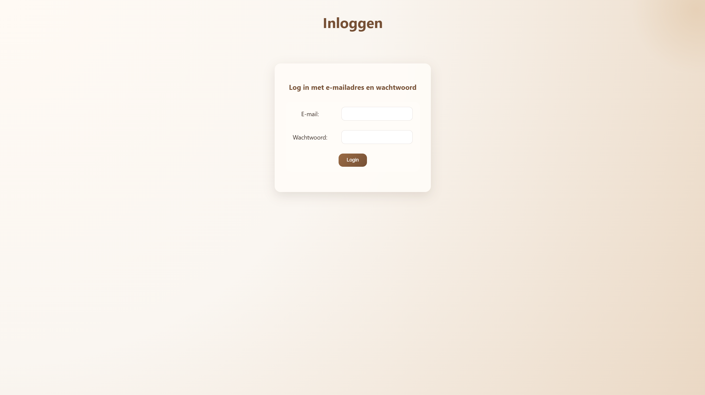
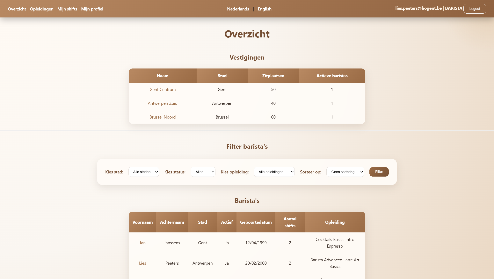
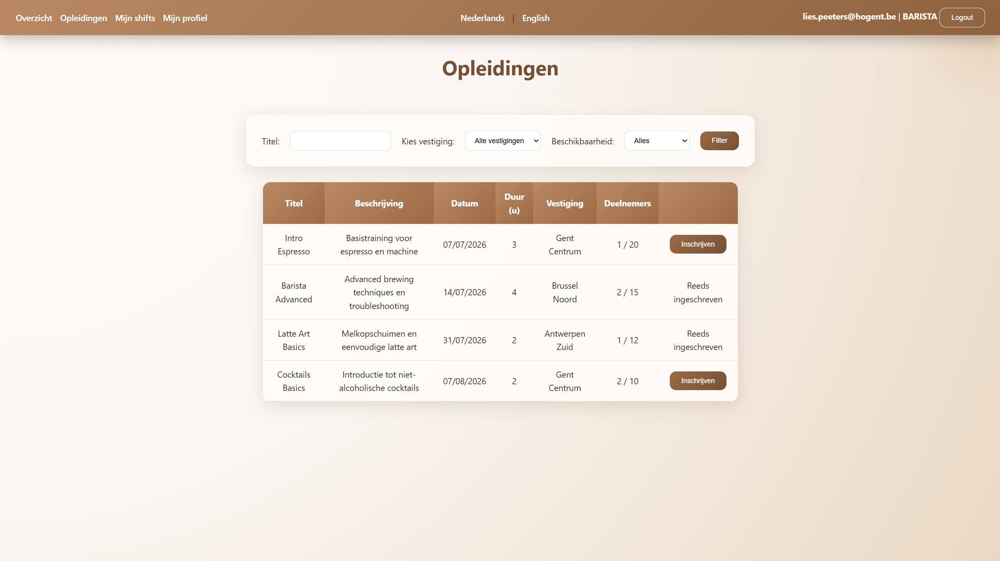
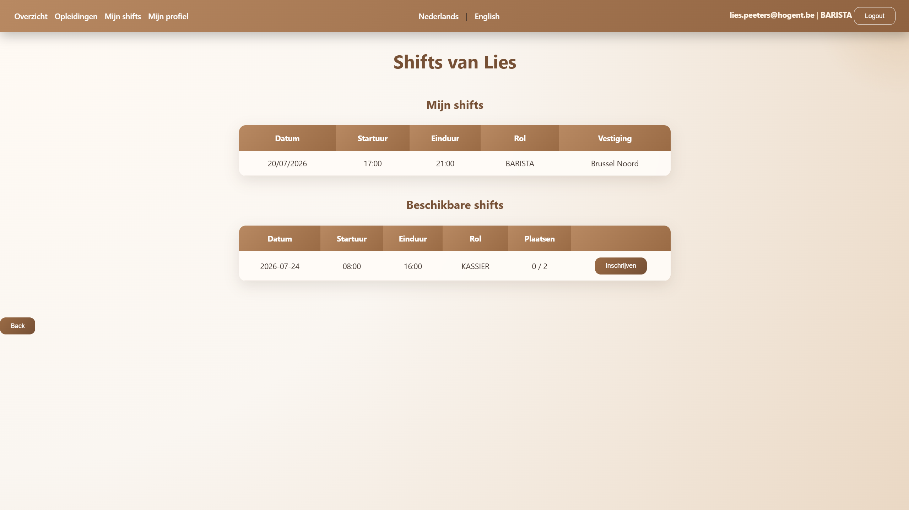
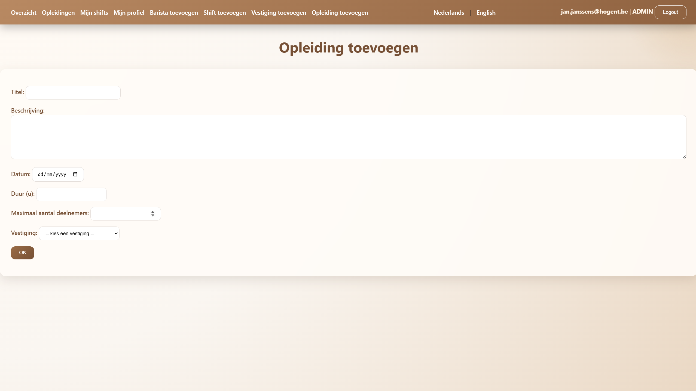

# ☕ Barista Job Management

Een webapplicatie voor het beheren van barista's, vestigingen, shifts en opleidingen.

Dit project laat toe om een volledige workflow te beheren binnen een koffiebarorganisatie:
- barista's beheren
- vestigingen opvolgen
- shifts plannen en inschrijven
- opleidingen organiseren
- rollen en toegangsrechten beheren

---

## ✨ Functionaliteiten

### 👤 Gebruikersbeheer
- Registratie en beheer van barista-profielen
- Persoonlijke gegevens bekijken en aanpassen
- Rollen gebaseerd op Spring Security:
    - **ADMIN**
    - **BARISTA**

### ☕ Vestigingen
- Vestigingen toevoegen en beheren
- Overzicht van:
    - aantal zitplaatsen
    - actieve barista's
    - geplande shifts
    - beschikbare opleidingen

### 📅 Shiftbeheer
- Shifts aanmaken
- Barista's kunnen beschikbare shifts bekijken en inschrijven
- Overzicht van:
    - toekomstige shifts
    - afgelopen shifts
    - rol binnen de shift

### 🎓 Opleidingen
- Opleidingen beheren
- Barista's kunnen zich inschrijven
- Capaciteitscontrole:
    - beschikbare plaatsen
    - volgeboekte opleidingen

### 🌍 Internationalisatie
- Ondersteuning voor:
    - Nederlands
    - Engels 
---

# 🛠️ Technologieën

## Backend
- Java
- Spring Boot
- Spring MVC
- Spring Data JPA
- Spring Security
- Spring Reactive Web
- Jakarta Validation, Custom Annotations en Validators
- Hibernate
- MySQL

## Frontend
- Thymeleaf
- HTML
- CSS
- JavaScript

## Testing
- JUnit
- Spring Boot Test

---

# 🚀 Installatie

## Vereisten

Zorg dat volgende software geïnstalleerd is:

- Java 17+
- Maven
- MySQL

---

## Database configuratie

Maak een MySQL database

Pas daarna `application.properties` aan:

Seeding gebeurt automatisch bij het opstarten van de applicatie.

```properties
spring.datasource.url=jdbc:mysql://localhost:3306/xxx
spring.datasource.username=<gebruikersnaam>
spring.datasource.password=<wachtwoord>
```

---

## Applicatie starten

Via IntelliJ:

1. Open het project
2. Run `BaristaJob2026Application`

De applicatie start standaard op:

```
http://localhost:8080
```

---

## 🔑 Testgebruikers

De applicatie bevat standaard testgebruikers om de verschillende rollen te testen.

| Rol | E-mail | Wachtwoord |
|---|---|---|
| ADMIN | jan.janssens@hogent.be | 12345678 |
| BARISTA | lies.peeters@hogent.be | 12345678 |

### ADMIN
Met het admin-account kan je:
- barista's beheren
- vestigingen beheren
- shifts aanmaken en aanpassen
- opleidingen beheren
- alle gegevens bekijken

### BARISTA
Met het barista-account kan je:
- eigen profiel bekijken
- beschikbare shifts bekijken en inschrijven
- eigen shifts opvolgen
- opleidingen bekijken en inschrijven

---


---

# 📸 Screenshots

Hieronder staan enkele screenshots van de applicatie.  
Deze geven een beeld van de belangrijkste functionaliteiten en gebruikersflows.

## Login



## Overzicht



## Opleidingen



## Shifts



## Admin CRUD



---