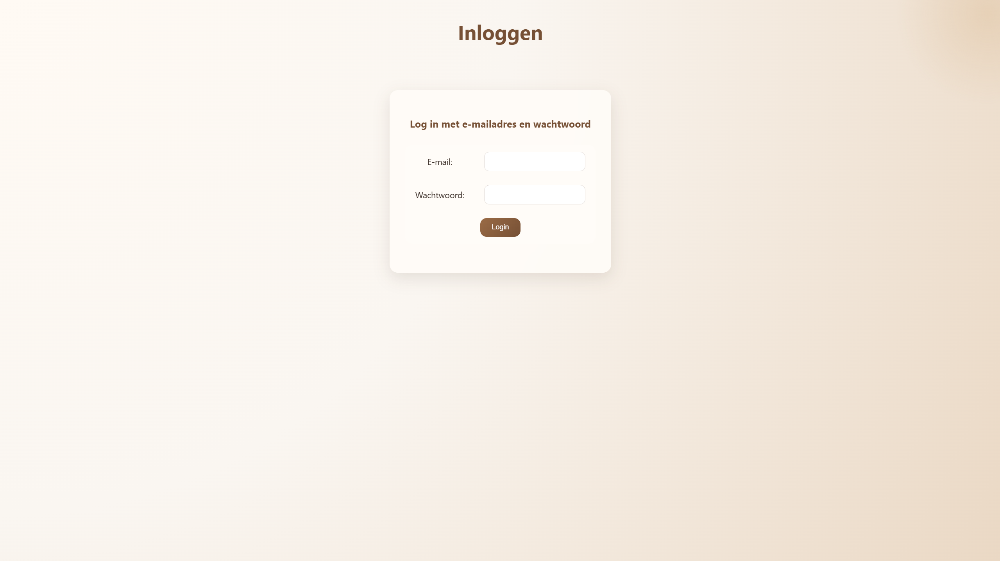
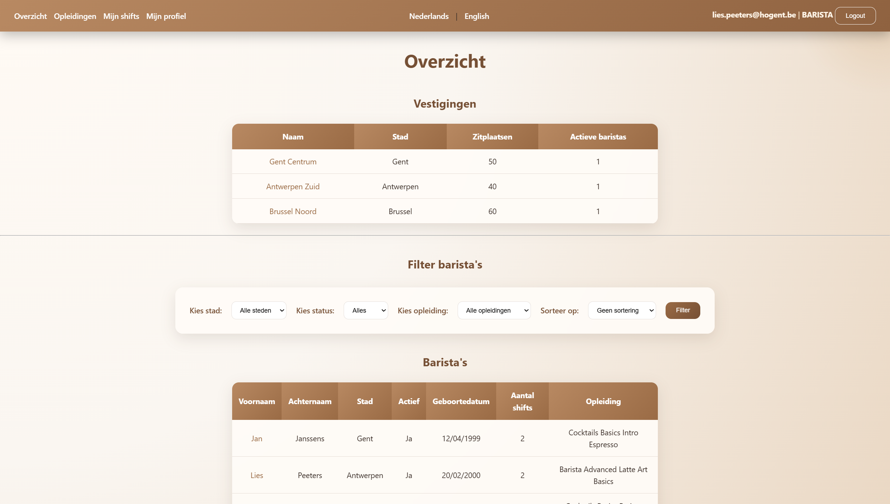
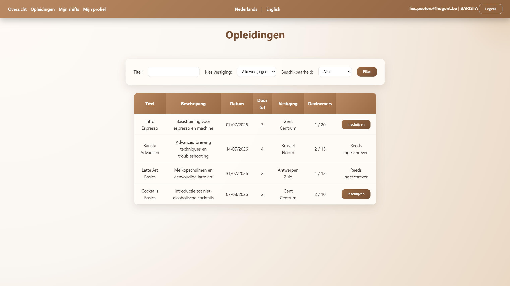
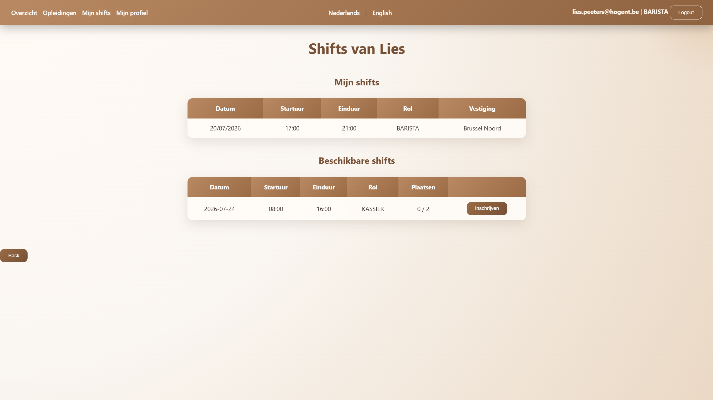
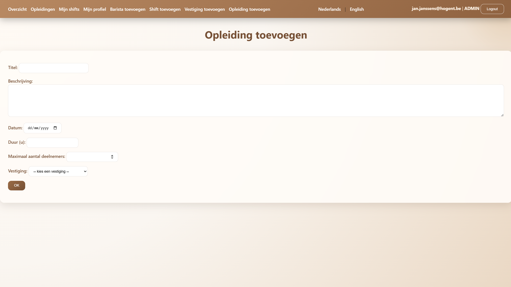

# Introductie

Dit project is mijn **examenopdracht voor Enterprise Web Development**, een vak uit het **tweede jaar van het traject Full Stack Development** in Toegepaste Informatica aan HOGENT. Ik **behaalde er 19/20** voor.

## Tech stack

De applicatie is gebouwd met Spring Boot en Spring MVC, met Thymeleaf voor de views. 

De persistentielaag gebruikt Spring JPA met Hibernate bovenop een MySQL-database. 

Voor de beveiliging wordt Spring Security gebruikt. Validatie gebeurt met Jakarta Validation, aangevuld met custom annotations en validators voor regels die de standaardannotaties niet dekken. 

Spring Reactive Web wordt gebruikt om externe API-calls te demonstreren. 

De tests zijn geschreven met JUnit en Spring Boot Test.

| Onderdeel | Technologie |
|---|---|
| Backend | Java, Spring Boot, Spring MVC, Spring Data JPA, Spring Security, Spring Reactive Web |
| Validatie | Jakarta Validation, eigen annotaties en validators |
| Database | MySQL, Hibernate |
| Frontend | Thymeleaf, HTML, CSS, JavaScript |
| Testen | JUnit, Spring Boot Test |

## Context

Een webapplicatie waarmee een koffieshop zijn barista's, vestigingen, shifts en opleidingen beheert.

Er zijn twee soorten gebruikers. Een admin met een CRUD interface: barista's, vestigingen, shifts en opleidingen aanmaken, aanpassen en verwijderen. 

Een barista: zijn profiel, de shifts waarvoor hij zich kan inschrijven en de opleidingen die hij kan volgen.

Per vestiging houdt de applicatie het aantal zitplaatsen, de actieve barista's, de geplande shifts en de beschikbare opleidingen bij. Shifts zijn opgedeeld in toekomstige en afgelopen shifts, met de rol van de barista binnen de shift. Bij opleidingen wordt de capaciteit bewaakt, zodat je je niet kan inschrijven voor een opleiding die volgeboekt is.

De interface is beschikbaar in het Nederlands en het Engels.

## Installatie

Vereisten: Java 17 of hoger, Maven en een lokale MySQL-installatie.

1. Maak een lege MySQL-database aan.
2. Pas in `application.properties` de verbinding aan:

```properties
spring.datasource.url=jdbc:mysql://localhost:3306/<databasenaam>
spring.datasource.username=<gebruikersnaam>
spring.datasource.password=<wachtwoord>
```

3. Open het project in een IDE en voer `BaristaJob2026Application` uit.

De applicatie draait daarna op `http://localhost:8080`. Bij het opstarten worden de testgegevens automatisch ingevoegd.

## Testgebruikers

| Rol | E-mail | Wachtwoord |
|---|---|---|
| ADMIN | jan.janssens@hogent.be | 12345678 |
| BARISTA | lies.peeters@hogent.be | 12345678 |

Met het admin-account kan je alle gegevens bekijken en beheren. Met het barista-account kan je je eigen profiel bekijken, je inschrijven voor shifts en opleidingen en je eigen shifts opvolgen.

## Screenshots

### Login


### Overzicht


### Opleidingen


### Shifts


### Admin (CRUD)

